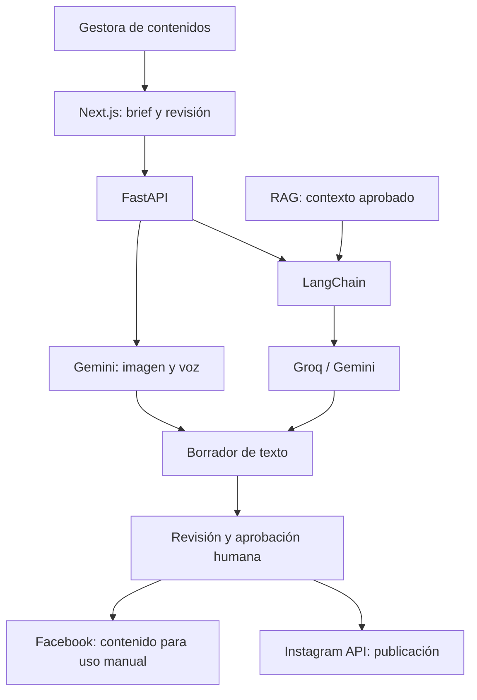
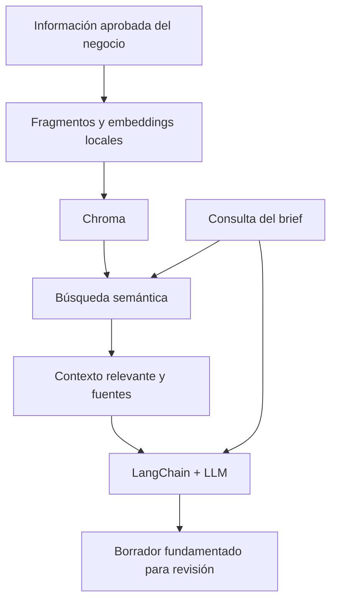

# Generador de contenido con LLMs

Una aplicación para transformar un brief y la información de un negocio en **borradores de contenido para Instagram y Facebook**, con revisión humana antes de publicar.

Está pensada para una **gestora de contenidos y copywriter que coordina una red de más de 20 pequeños negocios locales**. El MVP comienza con un negocio representativo y busca reducir el trabajo de redacción y adaptación, manteniendo el control editorial y la trazabilidad de la información.

## Qué hará el MVP

- Recoger un brief con tema, público, canal y contexto del negocio.
- Crear y revisar textos para publicaciones, carruseles y Reels.
- Recuperar información aprobada del negocio mediante **RAG** para fundamentar los borradores.
- Generar una imagen para previsualizar un post de Instagram; los carruseles y Reels reciben planes creativos.
- Permitir introducir briefs y solicitar revisiones por voz.
- Conectar una cuenta profesional de Instagram mediante OAuth y publicar **solo tras una aprobación humana explícita**.

Facebook se utiliza para generar y adaptar contenido; su publicación directa queda fuera del MVP. Stories y LinkedIn quedan para una etapa posterior.

## Stack y APIs previstos

| Capa | Tecnología | Uso |
|---|---|---|
| Frontend | Next.js · React · TypeScript | Brief, edición, previsualización y aprobación |
| Backend | Python 3.11+ · FastAPI · Pydantic | Validación y coordinación de servicios |
| Framework LLM | LangChain | Prompts, proveedores y flujo RAG |
| Texto | Groq API · Gemini API | Groq como proveedor principal; Gemini para comparación |
| RAG | Chroma local · embeddings multilingües locales | Recuperar contexto aprobado del negocio |
| Datos | SQLite · SQLAlchemy | Perfiles, borradores y metadatos |
| Imágenes | Gemini API · Gemini 3.1 Flash Image | Generar una imagen para revisión |
| Voz | Gemini Live API | Crear briefs y revisar borradores hablando |
| Publicación | Instagram Platform API · OAuth | Publicar contenido aprobado en una cuenta profesional |
| Calidad y entorno | pytest · GitHub Actions · Docker Compose | Pruebas y ejecución reproducible |

**LangChain coordina el flujo; Groq y Gemini ejecutan los modelos.** Las integraciones se incorporan por fases según los contratos aprobados. Los detalles están en [Stack tecnológico](docs/architecture/technology-stack.md).

## Cómo funciona

Flujo objetivo del MVP:

El RAG añade evidencia del negocio al proceso de generación:

## Estado actual

La base web/API está implementada: **FastAPI/Pydantic, cliente Next.js y endpoint de readiness**. Existe una frontera neutral con **LangChain Core y un mock determinista offline**, acompañada de pruebas sin proveedores reales ni credenciales.

La generación con proveedores reales, el RAG y las integraciones de imágenes, voz y publicación forman parte del alcance previsto; no se presentan aquí como funcionalidades terminadas. El avance se consulta en el [roadmap](docs/roadmap.md) y el [GitHub Project](https://github.com/users/gabrielagranja/projects/1).

## Desarrollo y fuente de verdad

Trabajamos sobre **`dev`**, con OpenSpec y Specification-Driven Development: **Issue → contrato aprobado → implementación → pruebas y evidencia**. Cada publicación en Instagram requiere confirmación humana.

La **rúbrica oficial forma parte de la fuente de verdad** y guía la trazabilidad del proyecto:

| Competencia | Peso |
|---|---:|
| C1 · Comunicación | 12 % |
| C2 · Gestión del proyecto con control de versiones | 16 % |
| C3 · Gestión de equipos | 18 % |
| C4 · Modelo NLP/IA | 54 % |

C4 exige **modelos LLM, un framework de aplicaciones LLM y arquitectura RAG**: tres indicadores de 18 % cada uno. La generación de imágenes, la comparación de modelos y Docker son decisiones del producto.

Documentación de referencia:

- [Visión y usuario](docs/project-charter.md) · [Alcance del MVP](docs/scope.md)
- [Rúbrica y trazabilidad](docs/rubric-traceability.md) · [Plan de evaluación](docs/evaluation-plan.md)
- [Roadmap](docs/roadmap.md) · [Decisiones](docs/decisions/) · [Preguntas abiertas](docs/assumptions.md)
- [Contratos OpenSpec](openspec/) · [Guía de contribución](CONTRIBUTING.md) · [Dailies](docs/daily/)
- [Issues](https://github.com/gabrielagranja/generador-contenido-llms/issues) · [Tablero del proyecto](https://github.com/users/gabrielagranja/projects/1)

**Entrega:** 13 de octubre de 2026 a las 12:00, Europe/Madrid. **Presentación técnica:** 14 de octubre de 2026.
