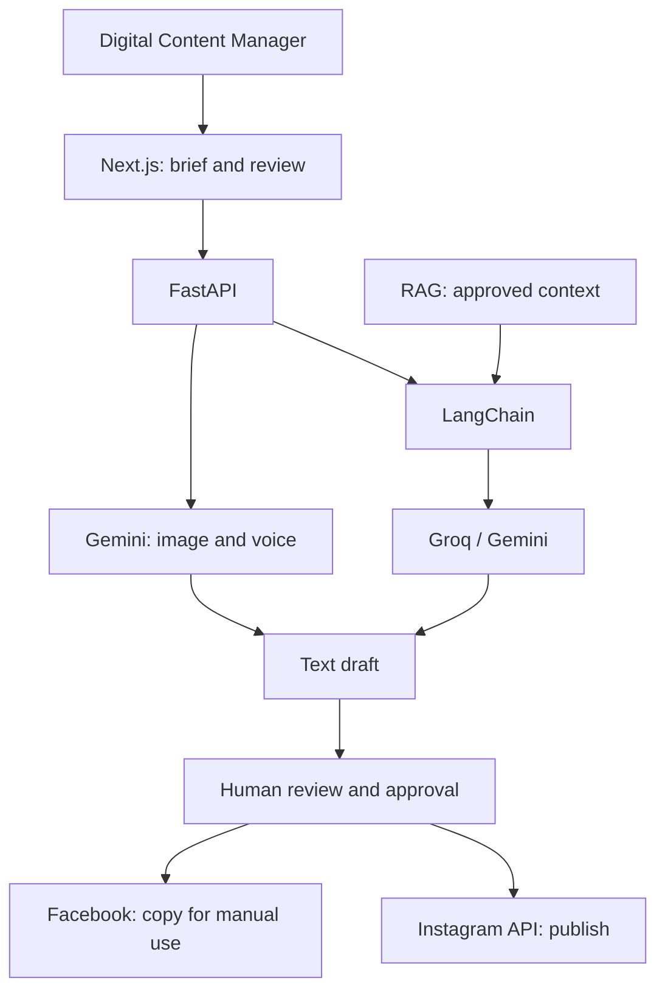
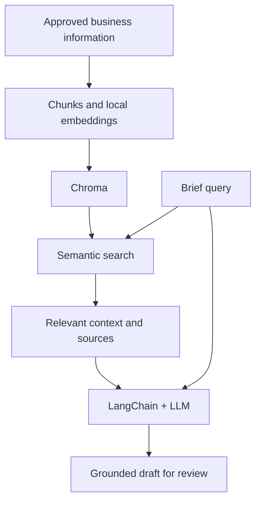

# LLM Content Generation MVP

An application that turns a brief and business knowledge into **editable content for Instagram and Facebook**, with human review before publication.

## Who it is for

The primary user is the **Digital Content Manager**: the person responsible for planning, creating, reviewing and coordinating digital content across a local-business network.

The MVP uses **Coll Amunt!, a Catalan traders' association with more than 20 local businesses**, as its example context. It starts with one representative business to validate the workflow before expanding across the association. Business owners can contribute information and review content; their customers and local community are the audience.

## More than a content generator

Coordinating an association's communication requires reliable business information, a consistent editorial voice and balanced visibility across members. Generating isolated posts does not address that whole workflow.

The product direction is an **intelligent editorial management tool for local-business networks**: help the person responsible decide **what to communicate, for whom, why now and with what supporting evidence**.

- **Maintain useful knowledge:** reusable business profiles, products, services, stories and tone guidance.
- **Ground drafts in evidence:** retrieve approved context with traceable sources instead of inventing business facts.
- **Support editorial planning:** eventually coordinate themes, campaigns and a balanced rotation of businesses.
- **Learn from history:** eventually use publication history and authorized performance data to inform future planning.

The MVP validates the brief-to-reviewed-content workflow first. Editorial planning and performance feedback are future stages requiring approved scope and contracts. The content manager retains editorial responsibility and the final publishing decision.

## MVP scope

- Capture a structured brief with topic, audience, channel and business context.
- Draft and revise copy for single-image posts, carousels and Reels.
- Retrieve approved business information through **RAG** to ground drafts.
- Generate one image for an Instagram feed-post preview; carousels and Reels receive creative plans.
- Enter briefs and request revisions through an optional voice mode.
- Connect one Instagram Professional account through OAuth and publish **only after explicit human approval**.

Facebook is a content-generation and adaptation channel; direct Facebook publishing is outside the MVP. Stories and LinkedIn are deferred.

## Planned stack and APIs

| Layer | Technology | Purpose |
|---|---|---|
| Frontend | Next.js · React · TypeScript | Briefs, editing, previews and approval |
| Backend | Python 3.11+ · FastAPI · Pydantic | Validation and service orchestration |
| LLM framework | LangChain | Prompts, provider adapters and RAG workflow |
| Text | Groq API · Gemini API | Groq as primary provider; Gemini for comparison |
| RAG | Local Chroma · local multilingual embeddings | Retrieve approved business context |
| Data | SQLite · SQLAlchemy | Profiles, drafts and metadata |
| Images | Gemini API · Gemini 3.1 Flash Image | Generate an image for review |
| Voice | Gemini Live API | Spoken briefs and draft revisions |
| Publishing | Instagram Platform API · OAuth | Publish approved content to a professional account |
| Quality and environment | pytest · GitHub Actions · Docker Compose | Testing and reproducible setup |

**LangChain coordinates the workflow; Groq and Gemini run the models.** Integrations are delivered in stages under approved contracts. See the [technology stack](docs/architecture/technology-stack.md) for details.

## How it works

Target MVP workflow:

RAG adds business evidence to generation:

## Current status

The web/API foundation is implemented: **FastAPI/Pydantic, a Next.js client and a readiness endpoint**. A provider-neutral boundary uses **LangChain Core with a deterministic offline mock**, supported by tests without real providers or credentials.

Live-provider generation, RAG, images, voice and publishing are planned capabilities. Progress is tracked in the [roadmap](docs/roadmap.md) and [GitHub Project](https://github.com/users/gabrielagranja/projects/1).

## Development and source of truth

Development targets **`dev`** and follows OpenSpec-based Specification-Driven Development: **Issue → approved contract → implementation → tests and evidence**. Every Instagram publication requires human confirmation.

The **official assessment rubric is part of the project's source of truth**:

| Competence | Weight |
|---|---:|
| C1 · Communication | 12% |
| C2 · Project management with version control | 16% |
| C3 · Team management | 18% |
| C4 · NLP/AI model | 54% |

C4 requires **LLM models, an LLM application framework and a RAG architecture**: three indicators worth 18% each. Image generation, model comparison and Docker are product choices.

Reference documents:

- [Vision and user](docs/project-charter.md) · [MVP scope](docs/scope.md)
- [Rubric and traceability](docs/rubric-traceability.md) · [Evaluation plan](docs/evaluation-plan.md)
- [Roadmap](docs/roadmap.md) · [Decisions](docs/decisions/) · [Open questions](docs/assumptions.md)
- [OpenSpec contracts](openspec/) · [Contributing guide](CONTRIBUTING.md) · [Daily logs](docs/daily/)
- [Issues](https://github.com/gabrielagranja/generador-contenido-llms/issues) · [Project board](https://github.com/users/gabrielagranja/projects/1)

**Delivery:** 13 October 2026 at 12:00, Europe/Madrid. **Technical presentation:** 14 October 2026.
